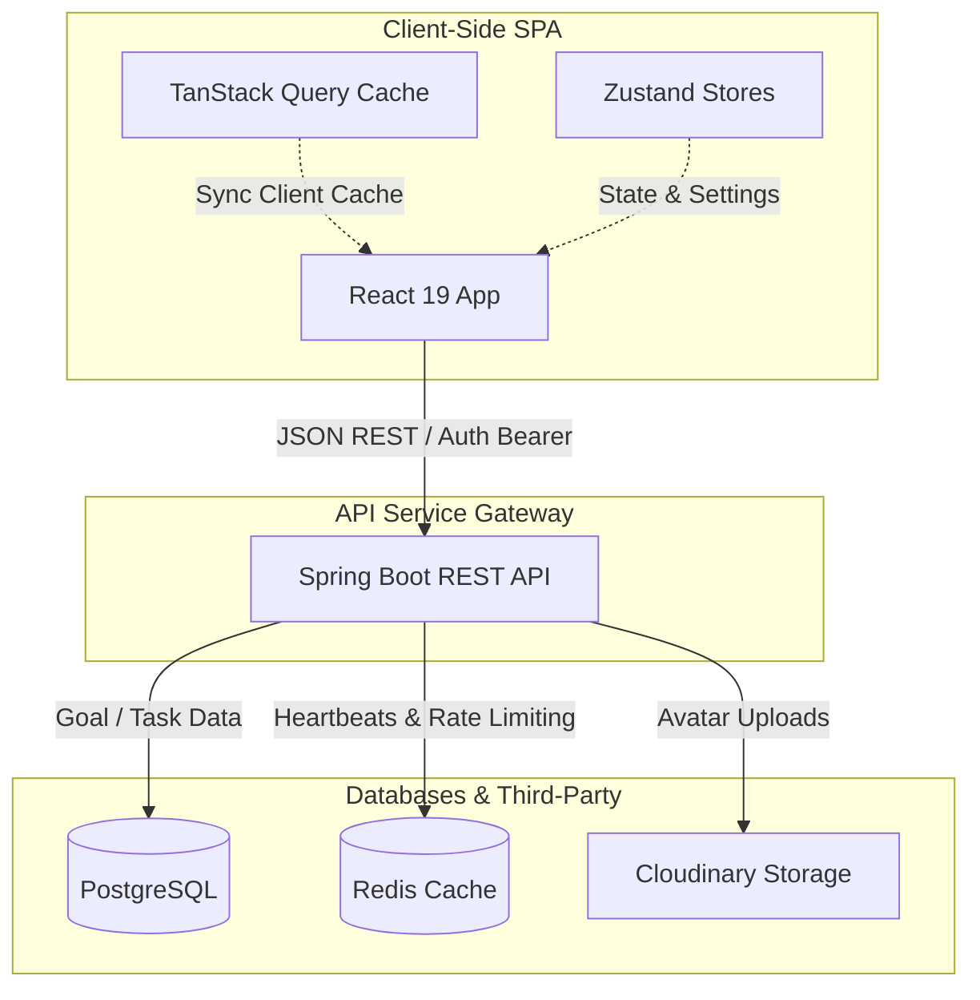

# MinuteMind Frontend

## High-Level System Architecture



MinuteMind is a gamified productivity application designed to help users break down targets, track granular progress via focus timers, earn streak rewards, and cooperate on shared goals. The Client SPA coordinates user interactions and stores settings, caching data locally and synchronizing states with the backend Spring Boot REST API.

---

## Core Focus Experience

The user workflow revolves around three core areas:
- **Timer Modes**: Features focused Pomodoro loops (`WORK` sessions), local and server-synchronized `BREAK` timers, ambient background audio options, and customizable background presets.
- **Progress Tracking & Analytics**: Tracks user streak habits relative to a custom focus minutes threshold. Computes activity grids and heatmap charts.
- **Social & Gamification**: Allows users to follow friends, participate in shared goals with peers, track leaderboard rankings, and unlock rarity-ranked badges (`COMMON`, `RARE`, `EPIC`, `LEGENDARY`).

---

## Technical Stack

- **Core UI Engine**: React 19, TypeScript, Vite
- **Global State Management**: Zustand
- **Asynchronous Cache**: TanStack React Query v5
- **Style System**: TailwindCSS & custom HSL CSS Variables
- **API Client**: Axios (configured with synchronized token rotation refresh interceptors)
- **Routing**: React Router v6

---

## Quick Start

1. Install modules:
   ```bash
   npm install
   ```
2. Start the dev server:
   ```bash
   npm run dev
   ```

---

## Documentation & Diagram Map

```mermaid
flowchart TD
    docs[System Documentation Map]
    
    docs --> Business[business/]
    docs --> Architecture[architecture/]
    docs --> Development[development/]
    
    Business --> domain[domain.md]
    domain --> d1[Productivity Data Flow]
    domain --> d2[Streak Calculation]
    domain --> d3[Badge Award System]
    
    Business --> goals[goals.md]
    goals --> g1[Goal Lifecycle]
    goals --> g2[Goal State Machine]
    goals --> g3[Task State Machine]
    
    Business --> sessions[sessions.md]
    sessions --> s1[Focus Session Lifecycle]
    sessions --> s2[Work Session State Machine]
    sessions --> s3[Session Management Flow]
    
    Business --> community[community.md]
    community --> c1[Shared Goal Workflow]
    community --> c2[Community Workflow]
    community --> c3[Invitation State Machine]

    Business --> journeys[journeys.md]
    journeys --> j1[New User Onboarding]
    journeys --> j2[Daily Productivity Loop]
    
    Architecture --> overview[overview.md]
    overview --> o1[Component & Folder Architecture]
    overview --> o2[Request Lifecycle]
    
    Architecture --> state[state.md]
    state --> st1[Authentication State Flow]
    
    Architecture --> design[design-system.md]
    design --> ds1[Theme Variable Mappings]
    
    Architecture --> api[api.md]
    api --> a1[Refresh Token Sequence]
    
    Architecture --> db[database.md]
    db --> db1[Client-side Data Model]
    
    Development --> setup[setup.md]
    setup --> dv1[Developer Setup Workflow]
    
    Development --> env[environment.md]
    env --> dv2[Environment Setup Workflow]
    
    Development --> perf[performance.md]
    perf --> dv3[Performance Optimization Architecture]
```



Use the table below to access specific technical sheets and their corresponding visual logic diagrams:

| Category | Document | Diagrams Included |
|---|---|---|
| **Root** | **[README.md](file:///d:/Working/Project/personal-project/minute-mind/fe-minute-mind/fe-minute-mind/minutes-mind/README.md)** | • High-Level System Architecture<br>• Diagram Index Map |
| **Business** | **[domain.md](file:///d:/Working/Project/personal-project/minute-mind/fe-minute-mind/fe-minute-mind/minutes-mind/docs/business/domain.md)** | • Productivity Data Flow<br>• Streak Calculation Workflow<br>• Badge Award System |
| **Business** | **[goals.md](file:///d:/Working/Project/personal-project/minute-mind/fe-minute-mind/fe-minute-mind/minutes-mind/docs/business/goals.md)** | • Goal Lifecycle<br>• Goal State Machine<br>• Task State Machine |
| **Business** | **[sessions.md](file:///d:/Working/Project/personal-project/minute-mind/fe-minute-mind/fe-minute-mind/minutes-mind/docs/business/sessions.md)** | • Focus Session Lifecycle<br>• Work Session State Machine<br>• Session Management Flow |
| **Business** | **[community.md](file:///d:/Working/Project/personal-project/minute-mind/fe-minute-mind/fe-minute-mind/minutes-mind/docs/business/community.md)** | • Shared Goal Workflow<br>• Community Workflow<br>• Invitation State Machine |
| **Business** | **[journeys.md](file:///d:/Working/Project/personal-project/minute-mind/fe-minute-mind/fe-minute-mind/minutes-mind/docs/business/journeys.md)** | • New User Onboarding<br>• Daily Productivity Loop |
| **Architecture** | **[overview.md](file:///d:/Working/Project/personal-project/minute-mind/fe-minute-mind/fe-minute-mind/minutes-mind/docs/architecture/overview.md)** | • Component & Folder Architecture<br>• Request Lifecycle |
| **Architecture** | **[state.md](file:///d:/Working/Project/personal-project/minute-mind/fe-minute-mind/fe-minute-mind/minutes-mind/docs/architecture/state.md)** | • Authentication State Flow |
| **Architecture** | **[design-system.md](file:///d:/Working/Project/personal-project/minute-mind/fe-minute-mind/fe-minute-mind/minutes-mind/docs/architecture/design-system.md)** | • Theme Variable Mappings |
| **Architecture** | **[api.md](file:///d:/Working/Project/personal-project/minute-mind/fe-minute-mind/fe-minute-mind/minutes-mind/docs/architecture/api.md)** | • Refresh Token Sequence |
| **Architecture** | **[database.md](file:///d:/Working/Project/personal-project/minute-mind/fe-minute-mind/fe-minute-mind/minutes-mind/docs/architecture/database.md)** | • Client-side Data Model |
| **Development** | **[setup.md](file:///d:/Working/Project/personal-project/minute-mind/fe-minute-mind/fe-minute-mind/minutes-mind/docs/development/setup.md)** | • Developer Setup Workflow |
| **Development** | **[environment.md](file:///d:/Working/Project/personal-project/minute-mind/fe-minute-mind/fe-minute-mind/minutes-mind/docs/development/environment.md)** | • Environment Setup Workflow |
| **Development** | **[performance.md](file:///d:/Working/Project/personal-project/minute-mind/fe-minute-mind/fe-minute-mind/minutes-mind/docs/development/performance.md)** | • Performance Optimization Architecture |
