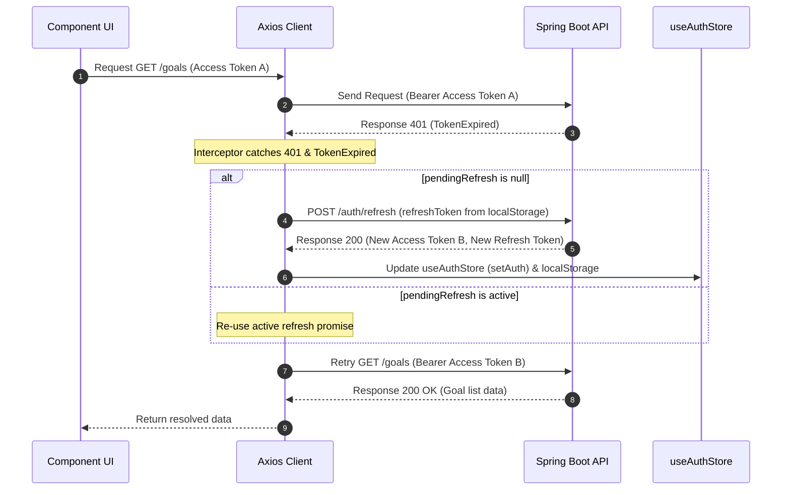

# API Integration and Cache Management

## Refresh Token Sequence



The application implements a silent token rotation mechanism inside the response interceptors of the Axios client. When any authenticated query fails due to an expired access token, the request is intercepted, a token refresh request is dispatched, the global credentials are updated, and the original request is re-attempted.

---

## Axios Interceptor Rules

The interceptor configurations reside in `src/services/api.ts` and enforce the following:
1. **Request Customization**: Adds the `Authorization: Bearer <accessToken>` header to every outgoing request if an access token is found in the `useAuthStore`.
2. **Synchronized Refresh Promise (`pendingRefresh`)**: If multiple requests fail with `TokenExpired` simultaneously, they wait on a single shared refresh promise. This prevents duplicate tokens refresh requests from triggering on the server.
3. **Fallback Logout Redirect**: If the refresh request itself fails (e.g., the refresh token has expired or is invalid), the interceptor clears local credentials via `clearAuth()`, removes `refreshToken` from localStorage, and forces a window redirect to `/login`.
4. **Auth Endpoint Skip**: Retrying and interception is bypassed for routes containing `/auth/` to prevent endless circular loops on authentication endpoints.

---

## React Query Caching

TanStack Query manages the client-side server-state cache. It uses key-based caching structures:

- **Goals Query Key (`['goals']`)**: Shared across dashboard pages and sidebar overlays.
- **Tasks Query Key (`['tasks', 'goal', goalId]`)**: Encapsulates specific task listings, ensuring that changes to one goal's tasks do not affect others.

### Invalidation Strategies
Upon completing a session, the application invalidates the goals query cache and the relevant tasks query cache:
```typescript
queryClient.invalidateQueries({ queryKey: ['goals'] })
if (goalId) {
  queryClient.invalidateQueries({ queryKey: ['tasks', 'goal', goalId] })
}
```
This forces immediate updates to total logged hours, task progress bars, and stats summaries.
