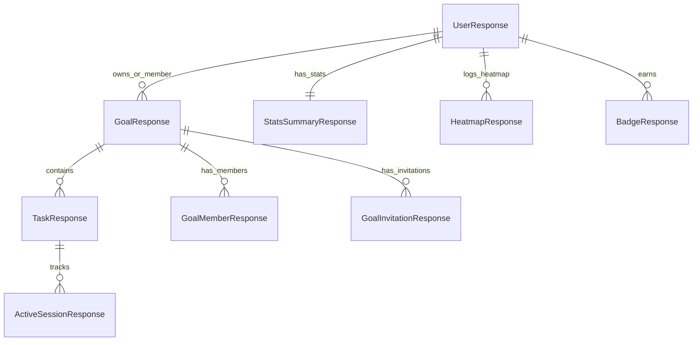

# Client-side Data Schema

## Client-side Data Model

Although the frontend does not maintain a relational database, it defines explicit TypeScript contracts matching the API payloads. This relational structure dictates how models are cached, updated, and combined.

---

## TypeScript Contracts

### 1. User and Authenticated Session
- **`UserResponse`**: Includes database IDs, emails, timezones, and daily thresholds.
- **`AuthResponse`**: Composes the user metadata along with access and refresh tokens.

### 2. Goals and Subtasks
- **`GoalResponse`**: Carries calculated fields like `totalLoggedMinutes` alongside the target, status, and share parameters.
- **`TaskResponse`**: References its parent goal via `goalId`, containing its estimated duration and progress fields.

### 3. Active Sessions and Recoveries
- **`ActiveSessionResponse`**: Holds the tracking parameters for running sessions (`sessionId`, `taskId`, `sessionType`, `plannedMinutes`, `startedAt`, `lastHeartbeatAt`).
- **`SessionCompleteRequest`**: Submitted to save work minutes. Contains notes and task state changes.

### 4. Stats and Gamification
- **`StatsSummaryResponse`**: Daily, aggregate, and streak statistics.
- **`BadgeResponse`**: Holds code labels, display icons, and rarity classifications (`COMMON`, `RARE`, `EPIC`, `LEGENDARY`).
- **`HeatmapResponse`**: Associates specific calendar dates with cumulative focus minutes.
