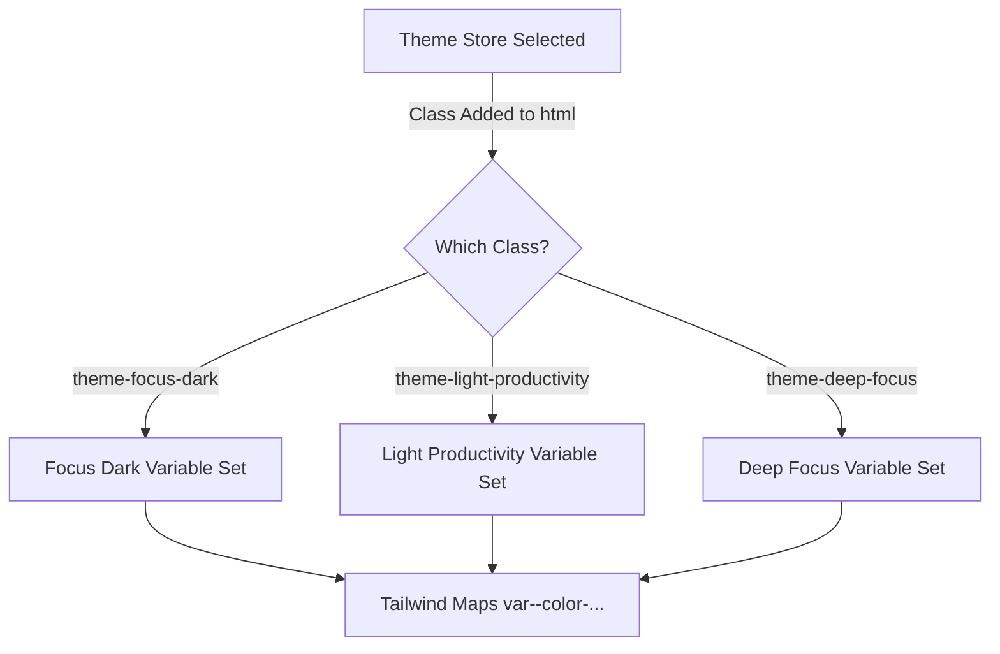

# Design System

## Theme Variable Mappings

The MinuteMind styling ecosystem utilizes theme-aware tokens powered by CSS Custom Variables mapped directly into the Tailwind configuration. This layout enables switches between themes without reloading or manually altering inline styling parameters.

---

## Tailwind CSS Theme Tokens

The theme-aware colors map dynamically to the active variables defined in `index.css`:

| Tailwind Color | Variable Name | Focus Dark (Default) | Light Productivity | Deep Focus |
|---|---|---|---|---|
| `background` | `--color-bg` | `#0F172A` | `#F8FAFC` | `#050507` |
| `surface` | `--color-surface` | `#1E293B` | `#FFFFFF` | `#0D0D10` |
| `surface-2` | `--color-surface-2` | `#1A2235` | `#F1F5F9` | `#111114` |
| `border` | `--color-border` | `#334155` | `#E2E8F0` | `#1C1C21` |
| `brand` | `--color-brand` | `#38BDF8` | `#3B82F6` | `#38BDF8` |
| `brand-dark` | `--color-brand-dark` | `#0EA5E9` | `#2563EB` | `#0EA5E9` |
| `brand-light` | `--color-brand-light` | `#E0F2FE` | `#EFF6FF` | `#082F49` |
| `text-primary` | `--color-text-primary`| `#F1F5F9` | `#0F172A` | `#E2E8F0` |
| `text-muted` | `--color-text-muted` | `#94A3B8` | `#64748B` | `#475569` |

### Static Colors (Unified across all Themes)
- `text-disabled`: `#3F3F46`
- `status-success`: `#22C55E`
- `status-warning`: `#F59E0B`
- `status-danger`: `#EF4444`
- `status-info`: `#3B82F6`

---

## Typography

MinuteMind configures two font families:
- **Sans-serif Font Stack**: `Inter`, `system-ui`, `sans-serif` (Assigned as default sans font).
- **Monospace Font Stack**: `JetBrains Mono`, `monospace` (Assigned as default mono font; used specifically for timer number readouts, code snippets, and structured logs).

---

## Micro-Animations & Transitions

Custom animations are registered directly in the Tailwind extension layout:

- **Fade-in (`animate-fade-in`)**: Smooth opacity transition for modals, overlays, and status alerts.
  - Keyframes: `from { opacity: 0 } to { opacity: 1 }`
  - Duration: `0.15s ease-out`
- **Slide-up (`animate-slide-up`)**: Slide up with fade-in effect for card lists and task panels.
  - Keyframes: `from { opacity: 0; transform: translateY(6px) } to { opacity: 1; transform: translateY(0) }`
  - Duration: `0.2s ease-out`
- **Auth Card Entrance (`fadeSlideUp`)**:
  - Keyframes: `from { opacity: 0; transform: translateY(12px) } to { opacity: 1; transform: translateY(0) }`
  - Duration: `0.35s ease-out 0.05s both`
