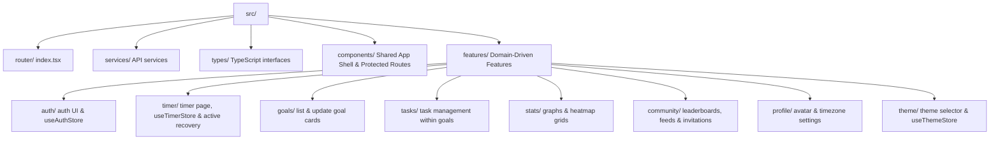
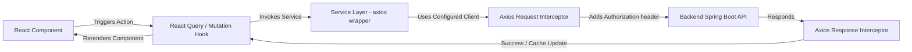

# Frontend Architecture Overview

## Component & Folder Architecture

MinuteMind Frontend adopts a domain-driven, feature-based architecture. Common routing, shared layouts, API clients, and TypeScript contracts are kept in centralized folders (`router`, `components`, `services`, `types`), while business domains are separated into dedicated directories inside `features`. Each feature packages its specific components, hooks, stores, and utilities, maintaining clear boundaries and high modularity.

---

## Request Lifecycle

The request flow is designed around asynchronous queries and mutations:
1. **User Interaction**: Triggered from the UI.
2. **Hook Layer**: Component invokes a TanStack Query hook, which coordinates caching and states.
3. **Service Layer**: The hook invokes a method from a corresponding API service.
4. **Axios Interceptor**: Inject JWT access tokens into request headers.
5. **API Request**: Request hits the backend API.
6. **Response Processing**: The response or error is filtered through response interceptors (handling expiration, retries, and token rotations).
7. **Cache & Render**: If successful, TanStack Query updates the cached state, prompting a re-render.
