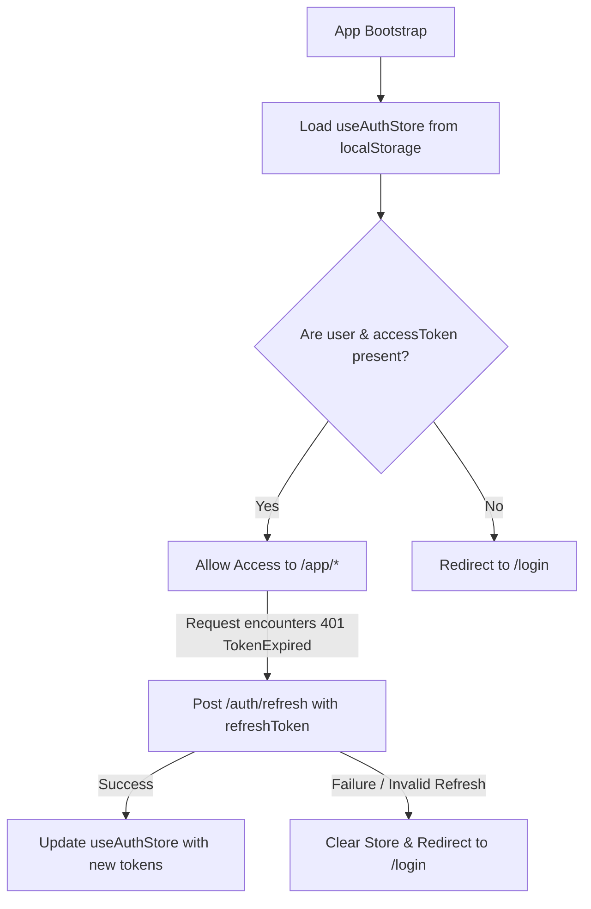

# Global State Management

## Authentication State Flow



The authentication flow relies on the local auth state synchronizing with server-issued JWT tokens. The store checks credentials on page load, intercepts unauthorized calls, and automatically routes the browser depending on authentication status.

---

## Zustand Store Specifications

### 1. Authentication Store (`useAuthStore`)
- **File**: `src/features/auth/store/useAuthStore.ts`
- **Purpose**: Manages authenticated user details and active access token credentials.
- **State Shape**:
  ```typescript
  interface AuthState {
    user: UserResponse | null     // User metadata (id, email, name, avatarUrl, timezone)
    accessToken: string | null    // Raw JWT access token used in requests
  }
  ```
- **Persistence**: Persisted using `zustand/middleware` under the storage key `auth-storage` (uses `localStorage` by default).
- **Key Actions**:
  - `setAuth(user, accessToken)`: Updates the current user info and active token.
  - `clearAuth()`: Resets the store variables to `null`, logging the user out.
  - `isAuthenticated()`: Evaluates if both `accessToken` and `user` profile are set.

---

### 2. Timer Store (`useTimerStore`)
- **File**: `src/features/timer/store/useTimerStore.ts`
- **Purpose**: Manages countdown variables, active task context, work session IDs, and objective notes.
- **State Shape**:
  ```typescript
  interface TimerStore {
    state: TimerState            // IDLE | RUNNING | PAUSED | BREAK
    sessionId: number | null     // Active session ID from backend
    taskId: number | null        // Target task ID
    taskTitle: string | null     // Cache of the active task's title
    goalColor: string | null     // Visual theme color derived from parent Goal
    sessionType: SessionType     // WORK | BREAK
    plannedMinutes: number       // Target minutes specified at start
    totalSeconds: number         // Planned duration in seconds
    timeRemaining: number        // Real-time remaining seconds
    actualMinutes: number        // Focus minutes completed so far (increments every 60s elapsed)
    endTime: number | null       // Expected absolute timestamp of completion
    startedAt: number | null     // Absolute timestamp of start
    sessionObjective: string | null // Persistent goal note entered by user
  }
  ```
- **Persistence**: Only persists the `sessionObjective` under the key `mm_timer`. General timer fields (countdown, IDs, states) are **omitted** from localStorage to prevent timer drift and outdated counters during reloads. Recovery of running sessions is delegated to backend sync API queries on reload.
- **Key Actions**:
  - `startSession(response, meta)`: Computes time boundaries and sets the state to `RUNNING` or `BREAK`.
  - `pauseTimer()`: Pauses countdown ticking, computes accumulated actual minutes, and nullifies `endTime`.
  - `resumeTimer()`: Extends `endTime` with current `timeRemaining` and resumes decrement ticks.
  - `tick()`: Decrements remaining seconds and calculates `actualMinutes` based on elapsed intervals.
  - `hydrateFromActive(response, meta)`: Reconstructs state from server recovery responses after page reloads.
  - `reset()`: Resets countdown state variables but preserves the current `sessionObjective`.

---

### 3. Theme Store (`useThemeStore`)
- **File**: `src/features/theme/store/useThemeStore.ts`
- **Purpose**: Saves and dynamically updates the visual interface theme styling.
- **State Shape**:
  ```typescript
  interface ThemeStore {
    theme: Theme                 // 'focus-dark' | 'light-productivity' | 'deep-focus'
  }
  ```
- **Persistence**: Saved under key `mm_theme`.
- **Key Actions**:
  - `setTheme(id)`: Removes existing styling classes (`theme-focus-dark`, `theme-light-productivity`, `theme-deep-focus`) from `document.documentElement` and adds the selected class. Updates the theme setting in the store state.
