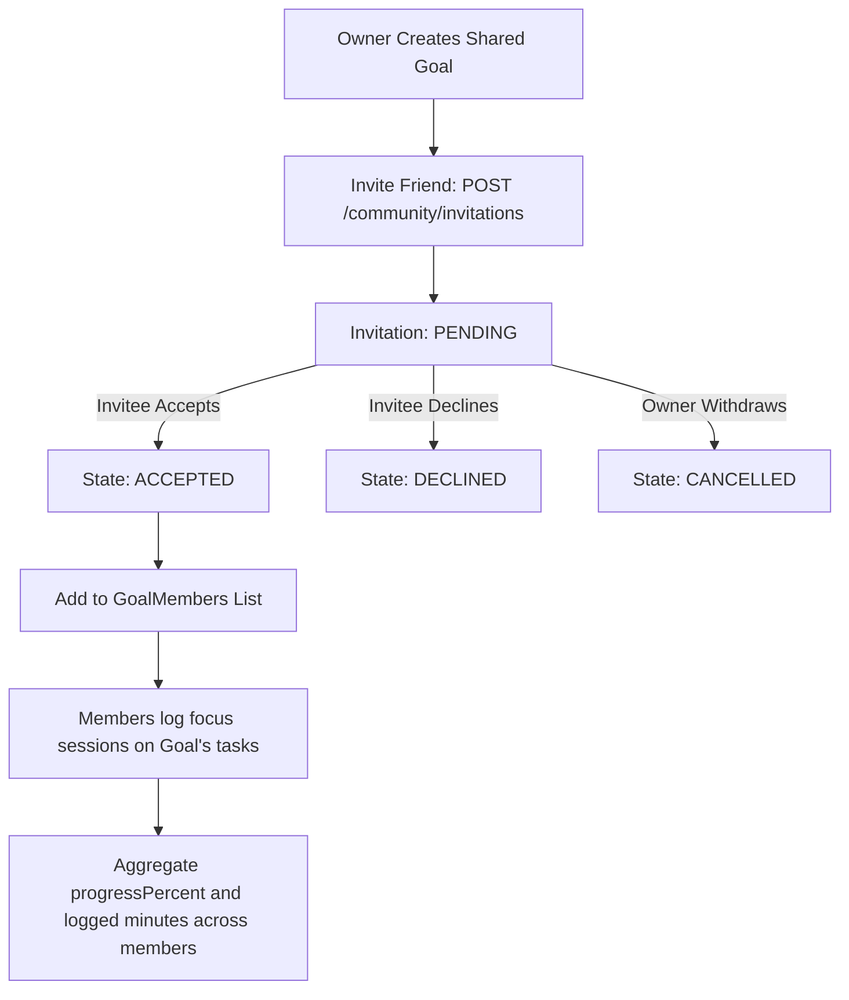
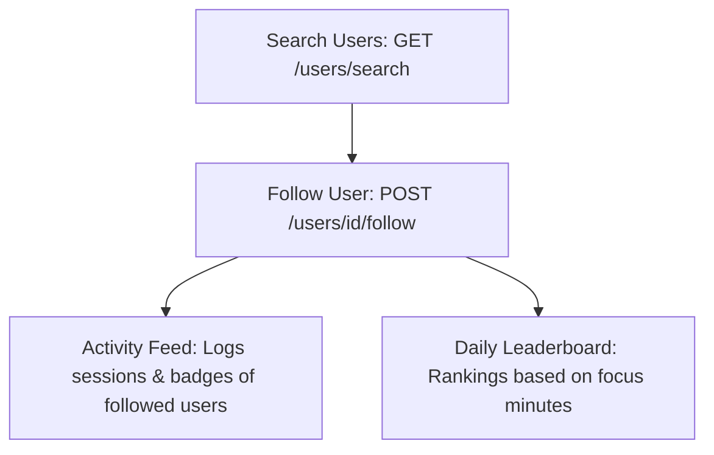
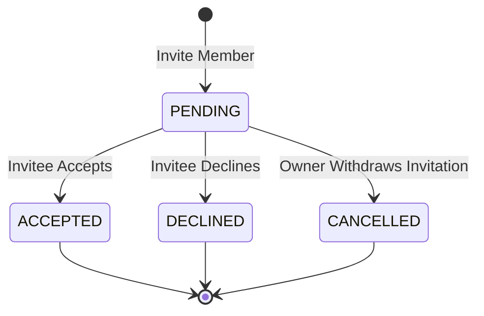

# Community and Shared Goals

## Shared Goal Workflow

Shared Goals allow collaboration on high-level productivity targets. The creator of the goal acts as the Owner and can invite other followed users. Invited users receive a invitation notification. Once they accept, they become members of the goal, meaning their logged focus minutes on tasks within that goal contribute to the shared goal's cumulative progress indicators.

---

## Community Workflow

MinuteMind's community system drives motivation through peer feedback and comparison:
1. **User Discovery & Following**: Users search for peers using email or name queries. Following a user enables access to their productivity feed and places them on the user's leaderboard.
2. **Activity Feed**: Automatically aggregates activities like completed focus sessions, achieved targets, and unlocked badges from followed users.
3. **Daily Leaderboard**: Ranks users and their friends by focus minutes accumulated today, creating clean gamified competition.

---

## Invitation State Machine

Goal invitations have a strict status lifecycle:
- **PENDING**: The invitation has been sent and is awaiting a response.
- **ACCEPTED**: The invitee accepted and is immediately added as a goal member.
- **DECLINED**: The invitee rejected the request.
- **CANCELLED**: The inviter cancelled the pending invitation before the invitee could respond.
