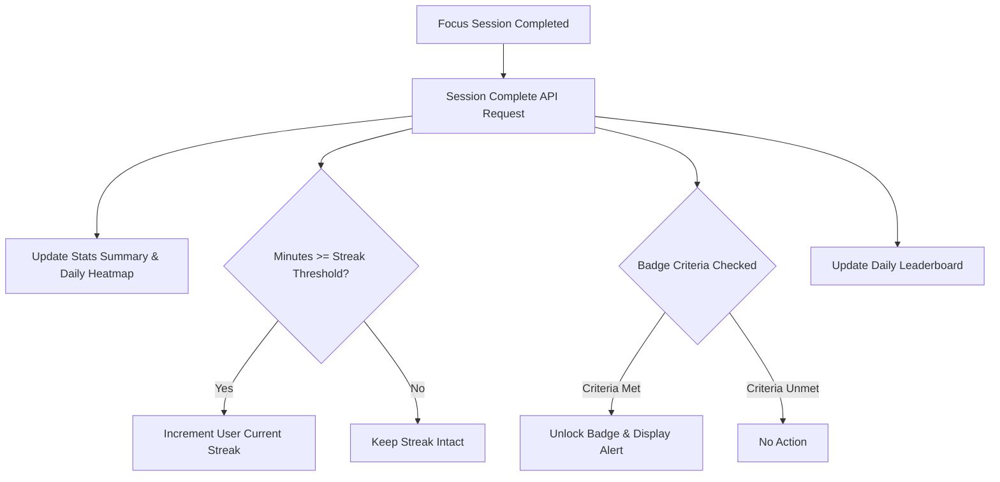
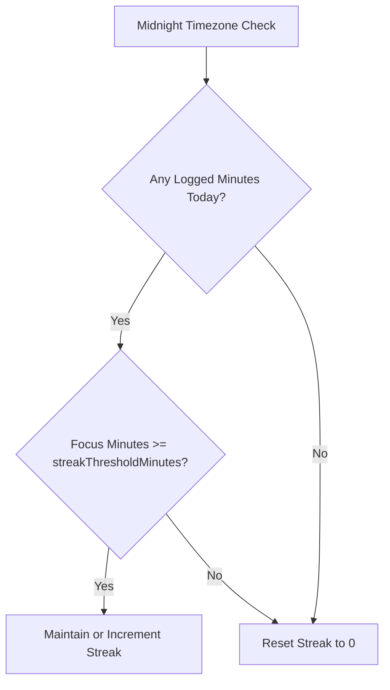
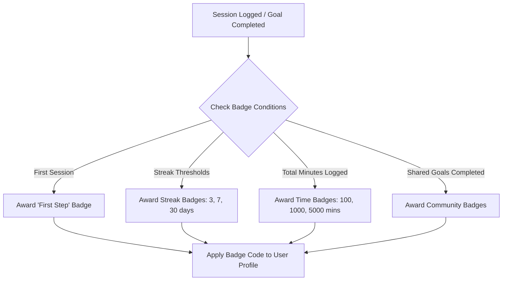

# Domain and Business Rules

## Productivity Data Flow

The productivity data flow defines how focus sessions trigger updates across the core domains of MinuteMind. When a focus session finishes, the application sends a completion payload (containing `actualMinutes`, `completedTask`, and `notes`) to the backend. The backend updates the total logged minutes, today's focus minutes, and active day statistics. In addition, the completed session alters the daily heatmap representation, adjusts the daily community leaderboard ranks, and acts as the trigger for updating streaks and evaluating gamification badges.

---

## Streak Calculation

Streak tracking is calculated based on the user's custom `streakThresholdMinutes` preference (defined in their Profile settings, defaults to 25 minutes). 
- **Requirement**: A user must log at least their threshold minutes within a single calendar day (in their local timezone) to sustain or increment their streak.
- **Breakage**: If the user fails to log the threshold amount of focus minutes before midnight in their designated timezone, the current streak resets to 0.

---

## Badge Award System

The gamification system rewards users with badges categorized by rarity levels (`COMMON`, `RARE`, `EPIC`, `LEGENDARY`). The evaluation takes place automatically upon logging a session or completing a goal. Once a badge criteria is met, the backend links the badge code to the user profile, allowing the frontend to retrieve the list of earned badges and display them on the profile page.
