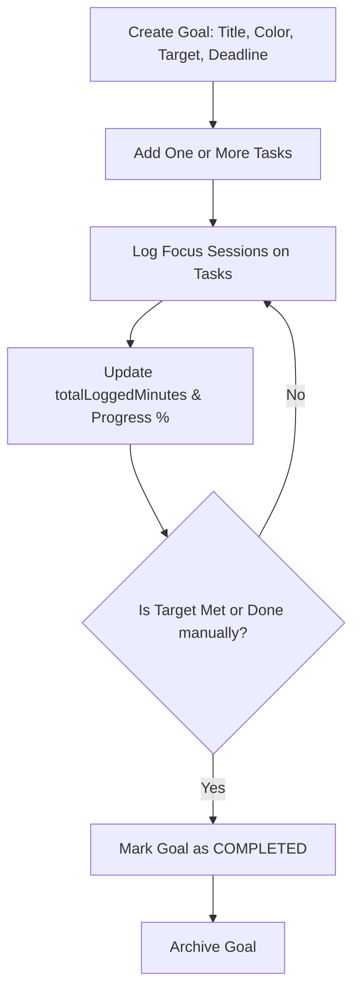
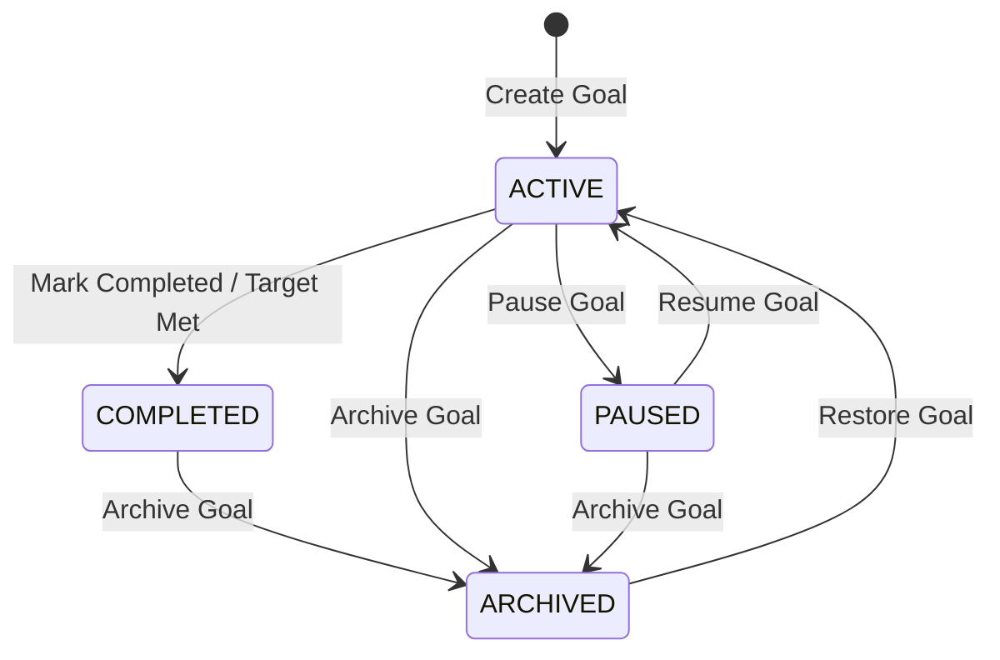
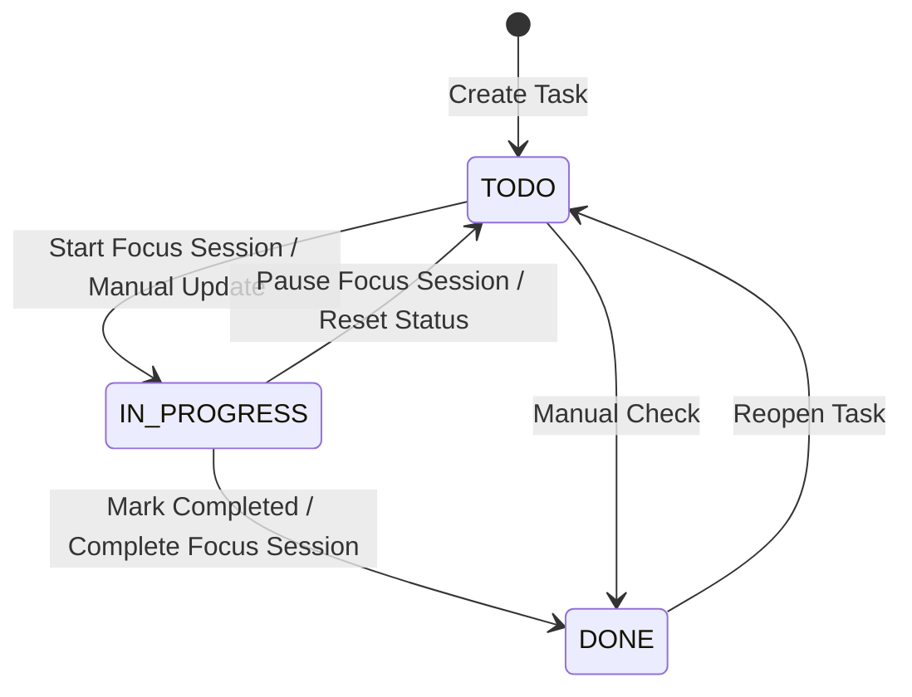

# Goals and Tasks Management

## Goal Lifecycle

Goal management allows users to break down their long-term productivity targets into specific categories. A goal has visual properties (color styling), target parameters (expected focus minutes), a timeframe (deadline), and collaboration attributes (whether it is shared with friends). The lifecycle progresses from initial creation to task planning, focus session execution, progress aggregation, and eventual completion or archiving.

---

## Goal State Machine

Goals can transition through multiple states to reflect their current status:
- **ACTIVE**: The goal is current, and users can log tasks and timer sessions against it.
- **PAUSED**: Logging is suspended, and the goal is temporarily placed on hold.
- **COMPLETED**: The target minutes have been reached, or the user manually marked it complete.
- **ARCHIVED**: The goal is hidden from active dashboard views but retained in history.

---

## Task State Machine

Tasks represent the granular steps required to achieve a Goal. They carry estimated durations, track logged minutes, and transition as follows:
- **TODO**: The task is created and pending execution.
- **IN_PROGRESS**: Active focus sessions are currently being tracked or the user manually started working.
- **DONE**: The task is finished. Logging focus sessions can still occur but the progress is preserved.
