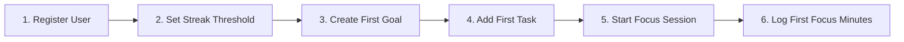
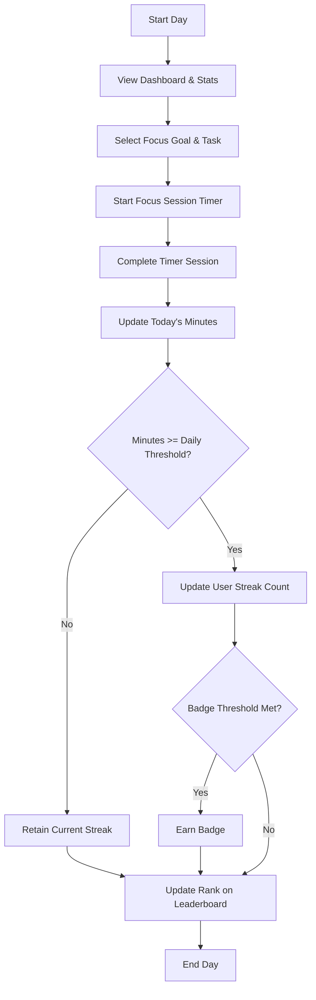

# User Journeys

## New User Onboarding

The onboarding flow introduces new users to the core loop of the app:
1. **Registration**: The user creates an account, defining their timezone.
2. **Setup Profile**: The user configures their preferred daily focus threshold.
3. **Goal Planning**: The user establishes a target (e.g., "Learn React").
4. **Task Breakdown**: The user creates concrete tasks within that goal (e.g., "Read Zustand docs").
5. **Initial Session**: The user launches the focus timer on that task and logs their very first session.

---

## Daily Productivity Loop

The daily productivity journey describes the repeat interactions that users perform on a daily basis:
1. **Start Day**: Check current streak, total work hours, and goals progress.
2. **Session Execution**: Select an active task and run a work or break session.
3. **Streak Update**: Accumulating focus minutes past the customized threshold updates and safeguards the streak count.
4. **Social & Gamification**: Check updated position on the community leaderboard, review followed activity, and look at newly earned badges.
