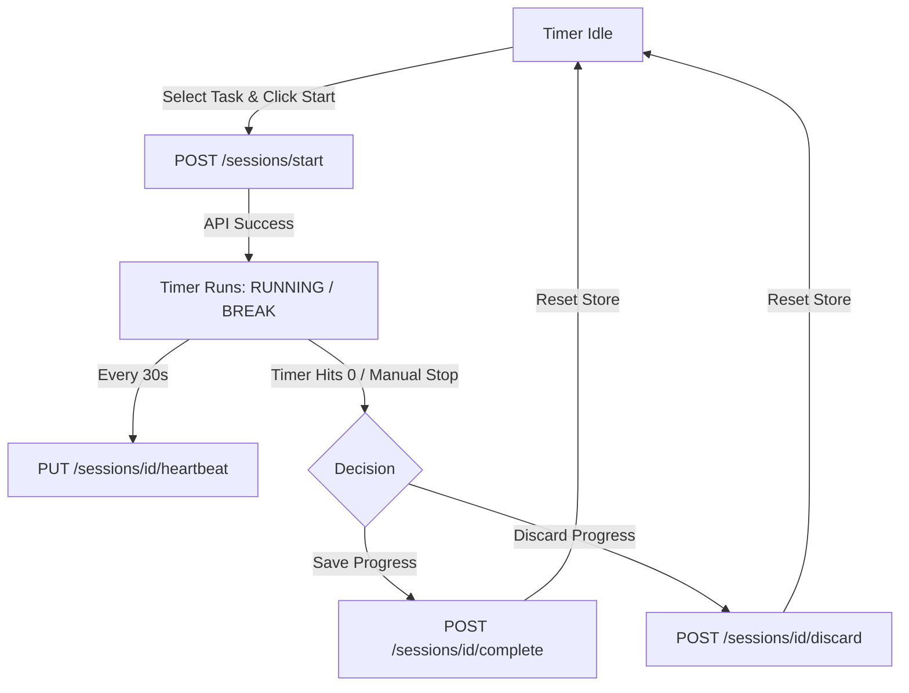
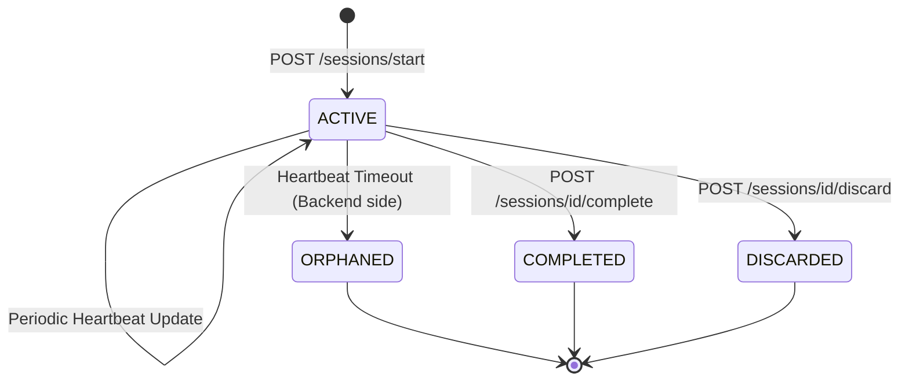
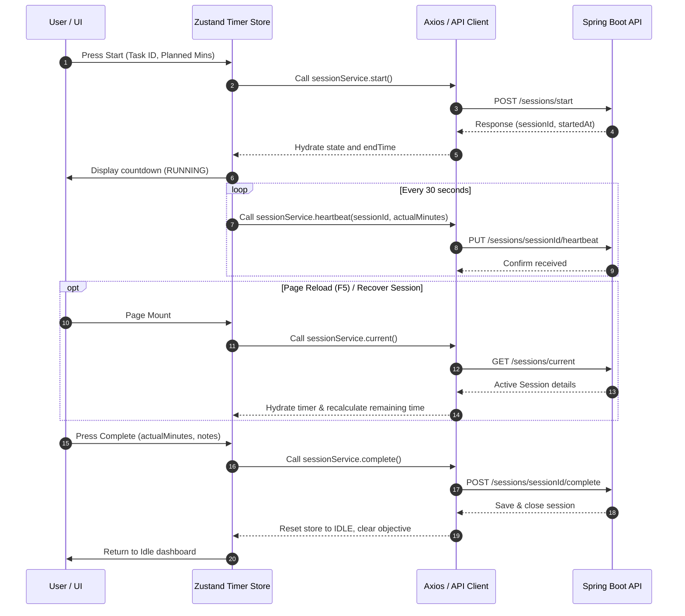

# Focus Sessions and Timer Synchronization

## Focus Session Lifecycle

The Focus Session Lifecycle controls how user work segments are recorded. A session must always be linked to a Task (unless it is a local Break session). When started, the frontend transitions into the running state, initiating countdown ticks and periodically updating the backend. Upon completion or cancellation, the user can choose to log the actual focus minutes or discard them entirely.

---

## Work Session State Machine

On the system side, the session progresses through these server-side states:
- **ACTIVE**: The session has been started and is actively receiving heartbeats.
- **COMPLETED**: The user finished the session and successfully stored the elapsed work minutes.
- **DISCARDED**: The user chose to cancel the session, removing the active record without saving minutes.
- **ORPHANED**: The user closed the window or lost connectivity, and no heartbeat was received within the server threshold.

---

## Session Management Flow

The sequence above outlines client-server communication during an active focus session. The frontend is responsible for tracking elapsed seconds locally via `setInterval` ticks while notifying the backend every 30 seconds via heartbeat updates. If the tab is closed, `navigator.sendBeacon` sends a final heartbeat payload. Upon reload, `useSessionRecovery` checks for any active sessions and recalculates the countdown time remaining.
