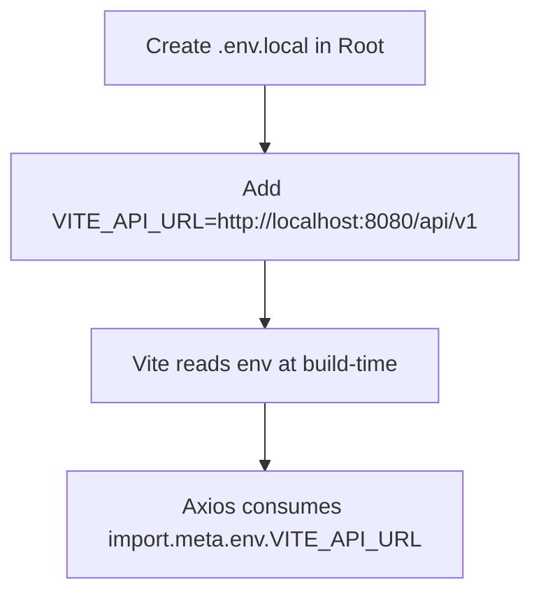

# Environment Variables

## Environment Setup Workflow

MinuteMind uses Vite's environment variables system. Variables prefixed with `VITE_` are exposed to the client-side code during compilation.

---

## Variable Specifications

### `VITE_API_URL`
- **Description**: The base endpoint of the Spring Boot REST API.
- **Default Value (if omitted)**: `http://localhost:8080/api/v1`
- **Scope**: Used by the Axios instance inside `src/services/api.ts` to coordinate client-server HTTP requests.
- **Example configurations**:
  - Local backend: `VITE_API_URL=http://localhost:8080/api/v1`
  - Staging backend: `VITE_API_URL=https://staging.minutemind.com/api/v1`
