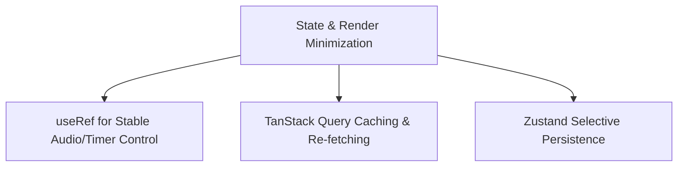

# Performance Strategies

## Performance Optimization Architecture

MinuteMind prioritizes responsiveness and fluid interactions by implementing state separation, ref stability, and query caching strategies.

---

## State and Render Minimization

### 1. Ref Stability (`useRef`)
To prevent infinite render loops and unnecessary component updates, mutable side-effects are stored in React references:
- **Audio Lifecycle Management (`useNotificationSound.ts`)**: Holds the active `HTMLAudioElement` and timeout schedulers in refs. Updating these elements stops playback without forcing the hook or its host component to re-render.
- **Heartbeat Rate-Limiter (`useHeartbeat.ts`)**: Stores the `lastSentRef` containing the most recently saved minutes. The effect runs on a 30s interval, but checks this reference first. If the focus minute count has not increased, it suppresses the network request.
- **Timer Count Reference**: Custom ticking intervals calculate values relative to stored timestamps rather than triggering state renders for every clock pulse.

### 2. Zustand Selective Persistence
- Storing full countdown metrics inside the `localStorage` creates severe drift issues (divergences between actual clock time and cached states) when tabs are left idle.
- MinuteMind resolves this by utilizing Zustand's `partialize` configuration to only persist structural, non-time-sensitive data like the `sessionObjective`. All countdown calculations are hydrated dynamically from the backend on page load.

---

## Network & Query Optimization

### 1. Query Cache Strategy
TanStack Query is configured with explicit cache durations:
- **`staleTime: 60_000`** (60 seconds) is applied to user profiles. This suppresses redundant profile queries as users click between dashboards, timer screens, and setting modules.
- **Key-Value Invalidation**: Cache entries are invalidated specifically on focus completion, ensuring fresh data is requested only when a change has occurred.
