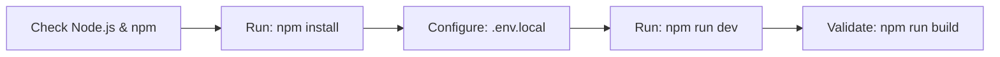

# Local Development Setup

## Developer Setup Workflow



This guide details how to install, run, and compile the MinuteMind React frontend codebase.

---

## Prerequisites

Ensure you have the following installed:
- **Node.js**: Version 18 or higher (LTS recommended).
- **npm**: Version 9 or higher.

---

## Local Installation

1. **Install dependencies**:
   ```bash
   npm install
   ```

2. **Run local dev server**:
   ```bash
   npm run dev
   ```
   The application will boot up at `http://localhost:5173`.

---

## Available Scripts

The package configuration exposes the following workflows:

- **`npm run dev`**: Starts Vite dev server with Hot Module Replacement (HMR).
- **`npm run build`**: Compiles TS/Vite source code into optimized assets inside the `dist/` directory.
- **`npm run preview`**: Serves the compiled `dist/` production assets locally for inspection.
- **`npm run lint`**: Checks for syntax patterns and rules using ESLint configurations.
